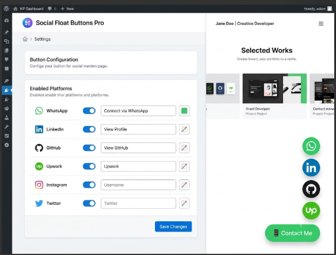

# 🔗 Social Float Buttons Pro

Floating social media contact buttons with toggle popup for WordPress.

---

## 📸 Screenshot

---

## ✨ Features

- Toggle popup with smooth animation
- 11 social platforms supported
- Customizable button text & color
- WhatsApp pre-filled message
- Left or right position
- Enable/disable individual icons
- Mobile responsive
- Security hardened
- Translation ready

## 🎯 Supported Platforms

| Platform | Icon |
|----------|------|
| WhatsApp | 💬 |
| LinkedIn | 💼 |
| GitHub | 💻 |
| Upwork | 🚀 |
| Instagram | 📷 |
| Twitter/X | 🐦 |
| YouTube | ▶️ |
| Telegram | ✈️ |
| Discord | 🎮 |
| Email | 📧 |
| Phone | 📞 |

## 📸 Screenshots

## 🚀 Installation

1. Download ZIP
2. WordPress → Plugins → Add New → Upload
3. Activate
4. Social Float → Settings
5. Configure & Save

## ⚙️ Settings

- Button text (emojis supported)
- Button color (color picker or hex)
- Position (bottom right/left)
- Enable/disable each platform
- Custom URLs & WhatsApp message

## 🔒 Security

- Nonce verification
- Input sanitization
- Output escaping
- Capability checks
- Direct access prevention
- Prepared SQL statements

## 👤 Author

**Junaid S.**
- [GitHub](https://github.com/junaid)
- [Upwork](https://www.upwork.com/freelancers/~0139f4995660a6a8ea)

## 📄 License

GPL v2 or later

---

⭐ **Star this repo if you find it useful!**